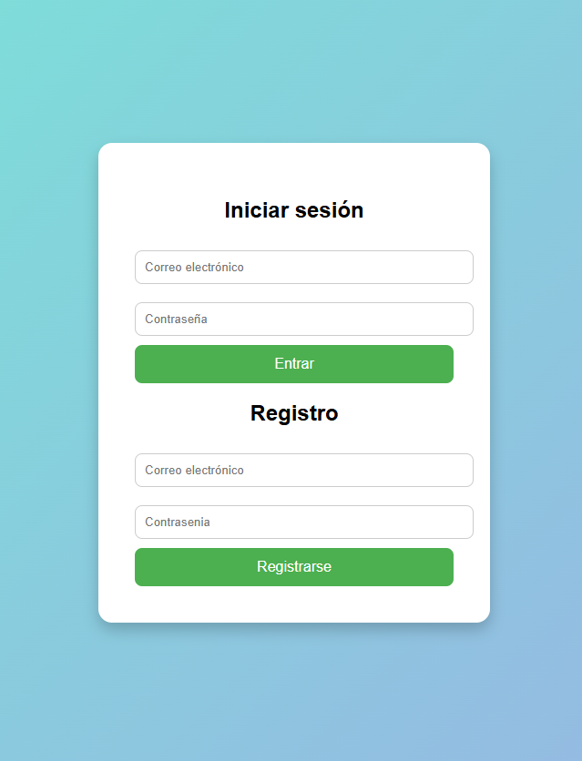

## 📱  Tarea 4. Desarrollo de un Servidor HTTP Seguro
**BK Programación** | Proyecto desarrollado por: **Irene Condado Alcantarilla**

En esta práctica, desarrollarás un servidor HTTPS en Java que permita a múltiples clientes (navegadores web) conectarse de forma concurrente y con un nivel de seguridad elevado. Este proyecto será una evolución de la tarea anterior, en la que ya implementaste un servidor para la gestión de líneas de una itv utilizando ServerSocket y manejando múltiples conexiones concurrentes.

Ahora partiremos de la solución de la tarea anterior y añadiremos los diferentes puntos a trabajar en esta tarea.

Nuestro servidor seguro estará compuesto por las mismas pantallas que ya tenía y simplemente se añadirá una primera pantalla de login:

## Pantalla Inicio sesión/Registro.

A continuación se detalla la pantalla de inicio (`img0.png`):

    Donde estará el formulario de inicio de sesión y registro.
      - Cuando se pulse en el botón de registro, se permanecerá en la misma pantalla y aparecerá un mensaje diciendo si el registro ha sido correcto o incorrecto.
      - En el caso de pulsar el botón login, si el logueo no se ha realizado correctamente, se permanecerá en la misma pantalla mostrando el correspondiente mensaje de error. Y si se realiza correctamente, pasará a la ruta /inicio, que será la página principal que ya teníamos de nuestro servidor ITV.
--- 
En esta ocasión, deberás modificar el servidor incorporando las siguientes mejoras de seguridad:

    - **Cifrado de la comunicación:** Cambiar el ServerSocket por un SSLServerSocket (o ServidorHTTPS) para asegurar que toda la comunicación se realice mediante HTTPS, utilizando certificados generados con keytool.
    - **Gestión segura de usuarios:** Crear una página web de inicio de sesión y registro en la que los usuarios introduzcan su usuario (email) y contraseña. (ojo con los '@')
    - **Comprobación mediante expresión regular:** Se deberá comprobar mediante expresión regular que tanto usuario como contraseña cumplen las restricciones al registrarse. El usuario debe cumplir el formato email y la contraseña debe ser de al menos 6 caracteres alfanuméricos (letras y números).
    - **Protección del fichero de usuarios:** Las credenciales de los usuarios se guardarán en un fichero de texto en la carpeta raíz el proyecto llamado usuarios.txt con el formato emailusuario:contraseña_hash.
    - Las contraseñas se transformarán en hash utilizando BCrypt, de modo que no se almacenen en texto plano. (se os facilitará la librería correspondiente).
    - Cada vez que un hilo servidor acceda a este fichero, éste lo descifrará, hará lo necesario y volverá a cifrar utilizando el algoritmo AES.
    - Se debe controlar el acceso concurrente al fichero, permitiendo múltiples lecturas pero sincronizando la escritura para evitar conflictos.
    - Validación de datos: Tanto en el lado del cliente (mediante atributos HTML) como en el servidor, se comprobará que los datos introducidos son los que se esperan y se capturarán mediante excepciones. Por ejemplo, debería provocar una excepción el insertar en el registro una contraseña con una longitud menor a 6 o no alfanumérica. Todas estas excepciones tienen que quedar registradas en un fichero log con el formato:

            FechaHora - MensajeError.

      Este fichero log, se llamará log.txt y se ubicará en la carpeta raíz del proyecto.

 Las dos acciones que deben quedar registradas mediante el log son: Cuando se realice un inicio de sesión incorrecto y la contraseña en el registro no cumpla los requisitos (indicando la contraseña introducida).

    - Integración: Tras un inicio de sesión o registro exitoso, el usuario se redirigirá a la página principal (/inicio) donde aparecerá la pantalla de nuestra ITV.
    - El servidor responderá dinámicamente a las peticiones HTTPS (GET y POST) y gestionará las rutas para cada pantalla.

## Descripción del Servidor:

### 1. Gestión de Conexiones y Seguridad de la Comunicación:

    - El servidor debe escuchar conexiones entrantes mediante un SSLServerSocket, lo que garantizará que la comunicación se realice de forma cifrada (HTTPS).
    - Para ello, se debe generar un certificado personal utilizando keytool y configurarlo en el KeyStore.
    - El servidor usará hilos para gestionar cada conexión de manera independiente, permitiendo la concurrencia y la fluidez en la interacción.

### 2. Sistema de Autenticación y Gestión de Usuarios:

    - Se implementarán formularios HTML para inicio de sesión y registro.
    - Durante el registro, la contraseña se convertirá a un hash utilizando BCrypt antes de almacenarse.
    - Los datos se guardarán en un fichero de texto, que estará cifrado con AES. Cada vez que se realice una operación de lectura o escritura sobre este fichero, se deberá descifrar o cifrar el contenido, respectivamente, y se deberá sincronizar el acceso para evitar conflictos entre hilos.

### 3. Servidor disponible y flujo de la aplicación:

    - El servidor responderá a distintas rutas.
    - Tras el registro o el inicio de sesión exitoso, el usuario será redirigido a la página principal.
    - El servidor gestionará cada petición HTTPS (GET y POST) de forma dinámica.

## Descripción del Cliente:

    - El cliente seguirá siendo un navegador web.
    - En el caso del inicio de sesión y registro, se enviarán los datos (email y contraseña) mediante peticiones POST.
    - El navegador mostrará las respuestas del servidor (páginas dinámicas, mensajes de error o éxito).
    
*Desarrollado como parte del módulo de Programación de Servicios y Procesos (PSP).*
